# Loom Groovebox User Manual

Welcome to Loom Groovebox, a powerful mobile synthesizer and sequencer designed for tactile performance and deep sound design.

---

## 2. Interface Overview

### Play Screen
The hub for live performance. Toggle between Melodic and Drum Kit layouts depending on your track type.

````carousel

<!-- slide -->
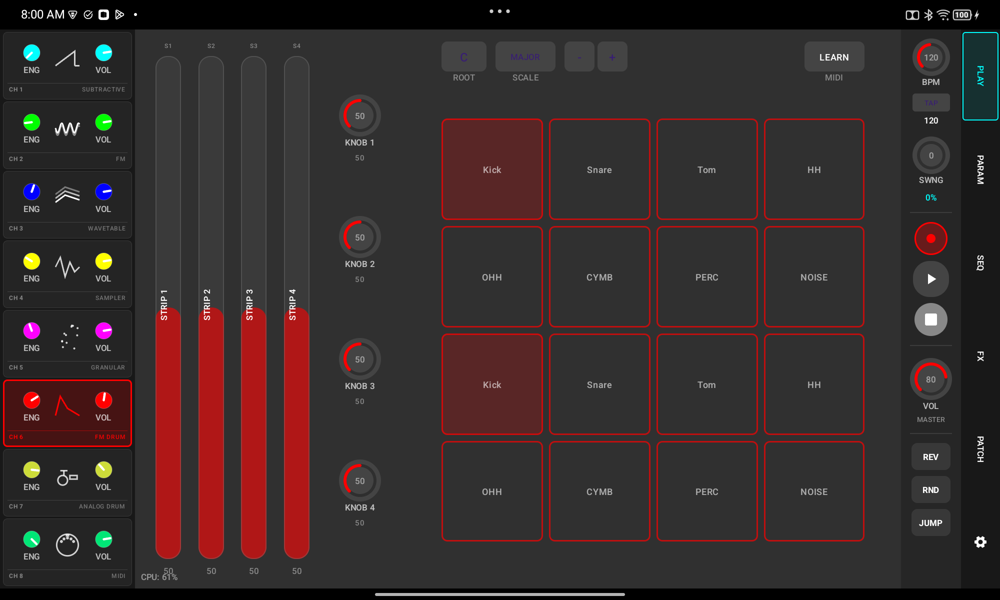
````

- **Arpeggiator Menu**: Long-press the **ARP** button to open the advanced Arpeggiator configuration.
    - **Rhythms**: 3 independent lanes (Root, Poly 1, Poly 2) for complex rhythmic patterns.
    - **Octaves & Inversion**: Expand the range or flip the chord voicing.
    - **Mutation**: Randomly swap notes in your arpeggio for evolving patterns.

---

### Sequencing Screen
Create and edit patterns with the 16-pad grid.

````carousel
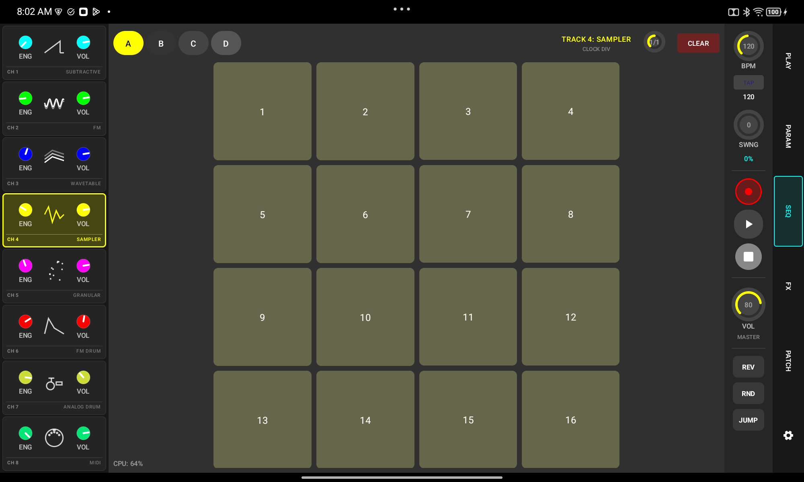
<!-- slide -->
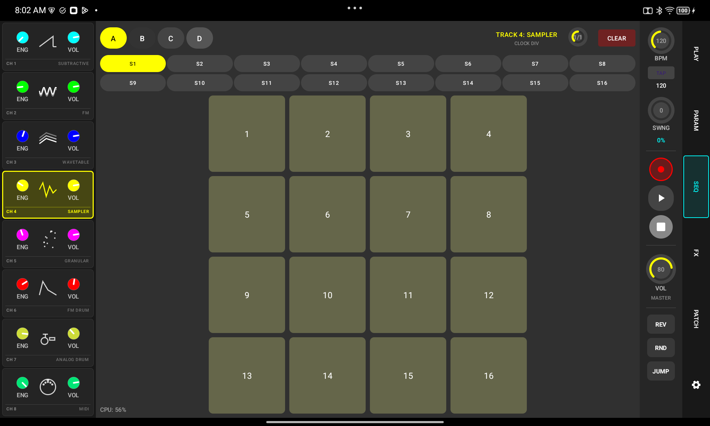
<!-- slide -->
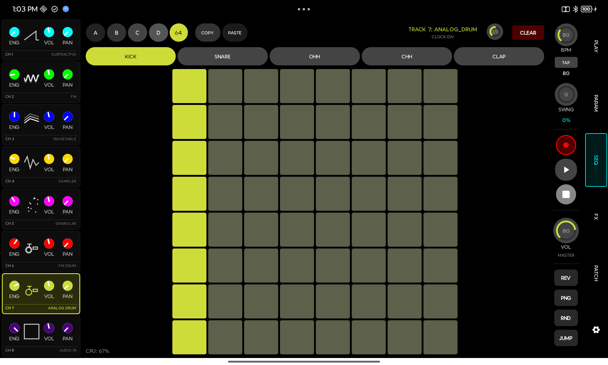
````

- **64-Step Sequencing**: Loom supports sequences up to 64 steps long.
    - **Bank Buttons (A-D)**: Toggle between 16-step pages to edit longer sequences.
    - **64 Grid View**: Tap the **'64'** button to view and edit the entire 8x8 step grid at once.
- **Step Options**: Long-press any active step to access the Step Editor.
    - **Visual Reference**: 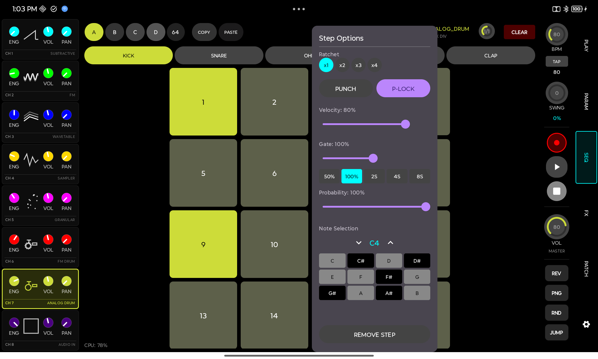
    - **Velocity**: Adjust the loudness of the step.
    - **Gate Length**: Control note duration. Gates > 100% create "Legato" slides. The range extends to **8.0 steps**, with a **cubic response curve** on the slider for surgical precision at short values.
    - **Probability**: Set the chance (0-100%) that the step will play.
    - **Ratchet**: Repeat the note multiple times within a single step.
    - **Remove Step (Polymetry)**: Tapping **Remove Step** completely excises the step from the sequence for that specific voice. This shortens the loop length, creating **polymetric drift** where voices move out of phase with the main clock.
- **Skipped Step Restoration**: Long-press a pad on the sequencer grid to restore a previously "removed" step.
- **Octave +/-**: Quickly shift the entire sequence pitch.

---

### Parameters Screen (Sound Design)
Shape your sound using the dedicated controls for each engine.

````carousel

<!-- slide -->
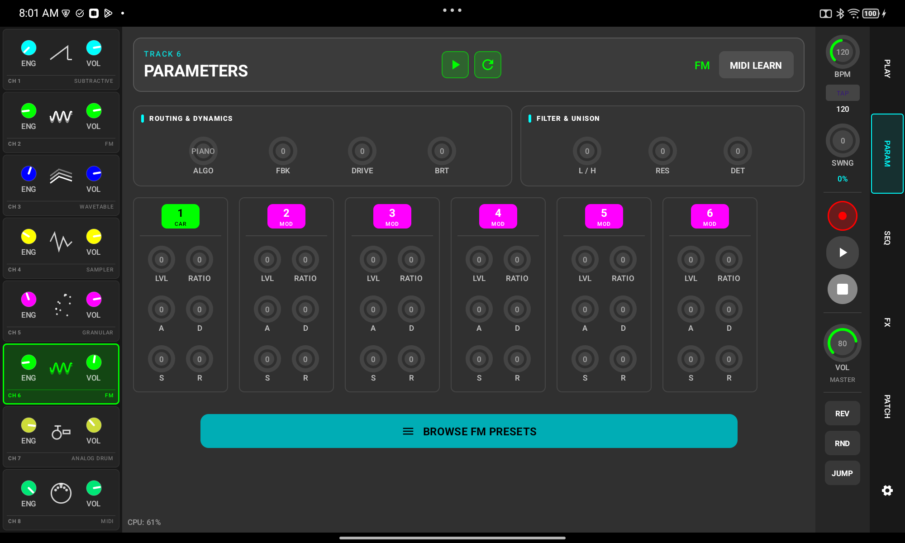
<!-- slide -->
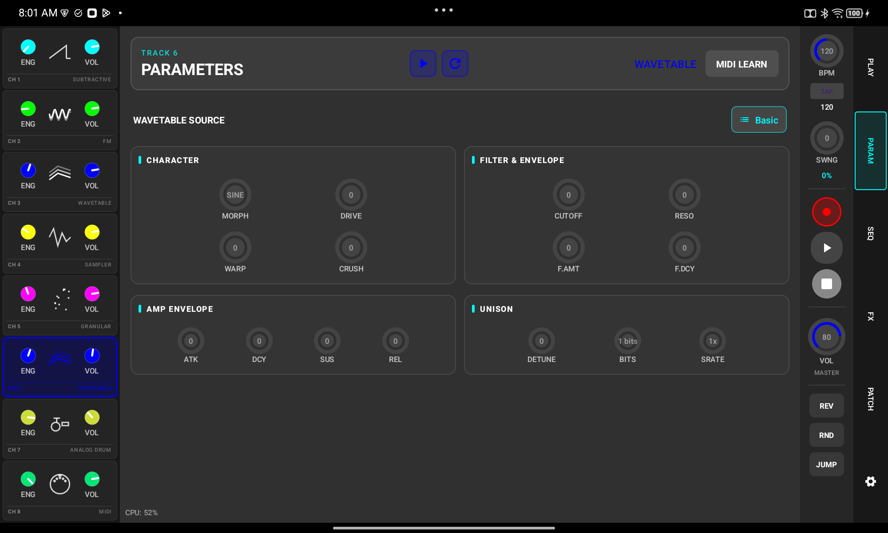
<!-- slide -->

<!-- slide -->

<!-- slide -->

<!-- slide -->
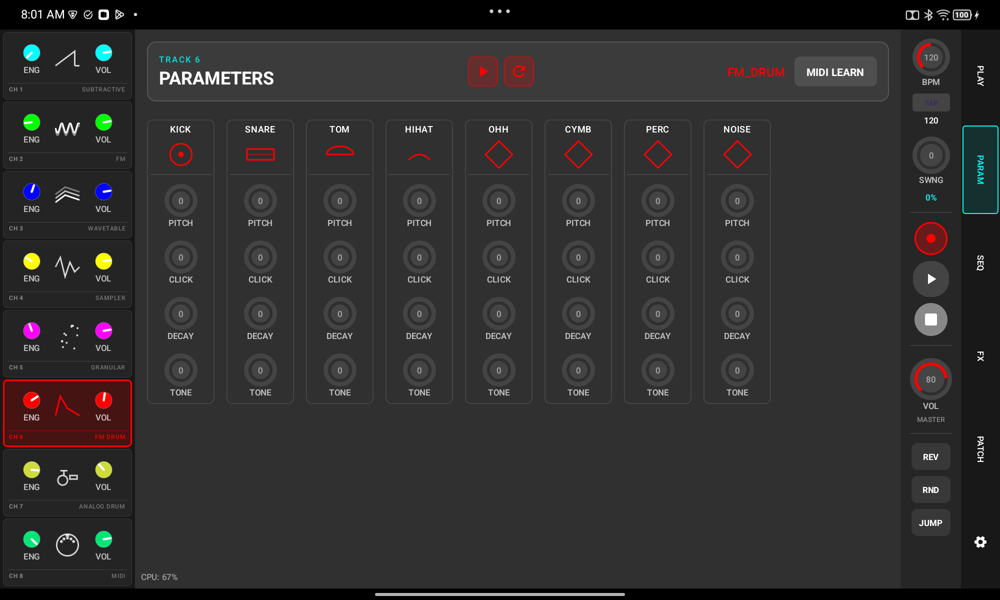
<!-- slide -->

<!-- slide -->

<!-- slide -->
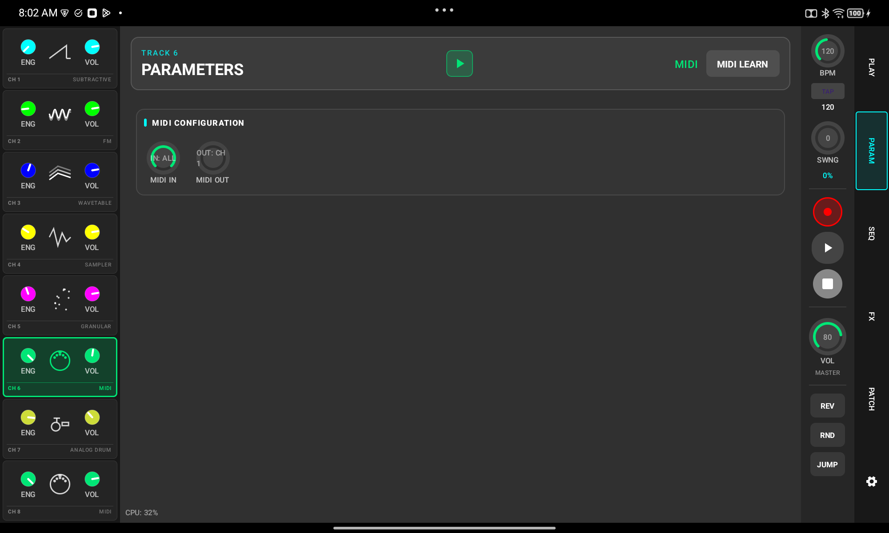
````

#### Subtractive Engine
**Sounds Like**: Classic 70s and 80s analog synths. Great for fat basses, lush pads, and sharp leads.
- **Osc 1-4 Pitch**: Semitone offset for each of the four oscillators.
- **Osc 1-4 Fold / Drive**: Add harmonic grit via wave-folding or traditional saturation.
- **PW (Pulse Width)**: Modifies the symmetry of square waves for "thin" or "nasal" timbres.
- **Cutoff / Resonance**: Filter the sound to remove high frequencies and add "squelch."
- **Detune**: Offsets oscillator pitches slightly for a thicker, wider sound.

#### FM Engine
**Sounds Like**: 80s digital synths (DX7). Excels at metallic bells, glassy pianos, and complex evolving stabs.
- **Algorithm**: Changes how the 6 operators modulate each other (from serial to parallel).
- **Brightness**: Global modulation depth; the "master harmonic control."
- **Op 1-6 Level / Ratio**: Individual volume and frequency multipliers for the 6 internal operators.
- **Feedback / FB Drive**: Routes signal back into the operator for harsh, noisy textures.

#### Wavetable Engine
**Sounds Like**: Modern digital synthesis. Known for morphing "dubstep" growls and evolving pads.
- **Position**: Sweeps through the frames of the current wavetable file.
- **Warp**: Non-linear phase distortion for unique harmonic shifting.
- **Crush / Bits / Srate**: Digital artifacts and lo-fi reduction for "crunchy" textures.
- **Detune**: Adds subtle pitch variation for a "chorused" feel.

#### Sampler Engine
**Sounds Like**: Traditional sample playback. Used for acoustic instruments, vocal chops, and found sounds.
- **Pitch**: Changes frequency without changing playback speed (Time-stretching).
- **Stretch**: Changes playback time without changing pitch.
- **Speed**: Classic tape-style control where time and pitch are linked.
- **Reverse**: Plays the loaded sample backwards.
- **Trim Start / End**: Defines the specific region of the sample to be played.
- **Sampler Modes**:
  - **One Shot**: Plays once to the end.
  - **Chopped**: Splits audio into 16 slices; each slice gets its own independent track.
  - **One Shot Chops**: Like Chopped, but slices play to the end when triggered.
  - **Loop**: Perpetually loops the selected region.

#### Granular Engine
**Sounds Like**: Ambient "clouds" and textures. Turns any sample into a wash of microscopic sound particles.
- **Position / Spray**: Where in the sample grains start, and how much random "jitter" is added.
- **Grain Size**: Length of sound particles; smaller is glitchy, larger is smooth.
- **Density**: How many grains are born per second.
- **Detune / Width**: Random pitch variation and stereo positioning for massive textures.
- **Reverse Prob**: The chance that any individual grain will play backwards.

#### Drum Engines (FM & Analog)
**Sounds Like**: High-impact percussion. FM is digital/metallic, Analog is warm/explosive.
- **Pitch (Tune)**: Root frequency of the drum hit.
- **Click (FM)**: Pitch envelope "snap" for kicks or noise burst for snares/hats.
- **Param A (Analog)**: Mode-specific control (*Punch* for Kicks, *Snappy* for Snares, *Spread* for Claps).
- **Param B (Analog)**: Controls *Detune* for metallic hats or *Grit* for other voices.
- **Decay**: Controls the length of the drum tail.

#### Audio In Engine
**Sounds Like**: High-end outboard processing. Run external gear through Loom's signal path.
- **Gain / Wavefold**: Boost and distort the external audio signal.
- **Gate ON/OFF**: When ON, audio only passes when a note is triggered.
- **Filter**: Dedicated Low-pass, High-pass, and Band-pass options with ADSR modulation.

#### MIDI Output
**Sounds Like**: Whatever external gear you connect!
- **Channel**: Selects the target MIDI channel (1-16).
- **Gate / Length**: Controls the duration of the external notes sent.

---

### Effects & Routing
Chain your tracks through high-quality FX and manage the signal path.

````carousel

<!-- slide -->
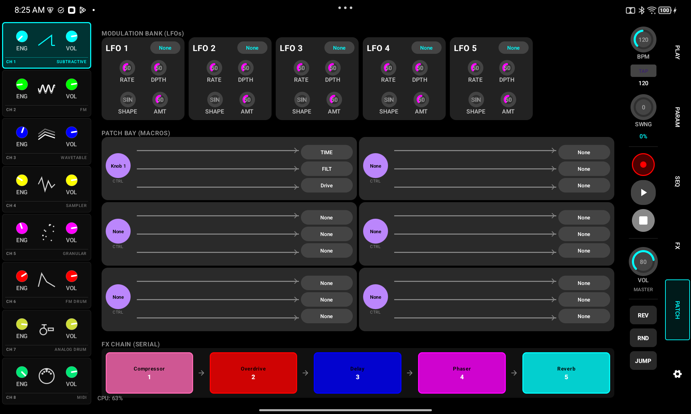
````

**Global Effects Suite**:
The effects chain processes audio in a semi-parallel bus structure. Each track has a **Send** amount to the FX bus.
- **Reverb (Hall)**: Spacious hall reverb with Size and Damping controls.
- **Delay**: Stereo delay with Feedback and Mix.
- **Overdrive**: Analog-style saturation and wave-folding.
- **Bitcrusher**: Reduces sample rate and bit depth for lo-fi textures.
- **Chorus / Phaser / Flanger**: Modulation effects for widening and motion.
- **Slicer**: Rhythmic gating effect synced to the tempo.
- **Compressor**: Dynamics control to glue the mix together.
- **Tape Wobble**: Simulates the pitch instability of worn tape.

**Routing Matrix**:
- Connect LFOs (Left Side) to any destinations (Top Labels).
- "Cables" show active connections. Tap a node to adjust modulation depth.

---

### Settings & Troubleshooting
Project management and system controls.

````carousel
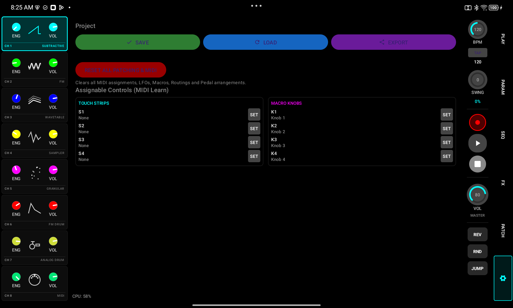
<!-- slide -->

````

- **RESET AUDIO ENGINE (PANIC)**: If the audio becomes silent, distorted, or "heavy," tap this button. It performs a **"Nuclear Reset"** by completely reconstructing the native audio engine, clearing out any bad state or NaN (Not-a-Number) values.
- **Project Files**: Save and Load your sessions. Note: Loading a project also triggers an engine reset for stability.

---

## 3. Advanced Features

### Arpeggiator Polyphony
The new Arpeggiator supports 3 rhythm lanes:
1. **ROOT (Bottom)**: Triggers the base note of the arpeggio cycle.
2. **UP 1 / UP 2 (Middle/Top)**: Cycle through the remaining held notes in a "staggered walk" pattern, allowing for complex polyphonic interplay even with monophonic engines.

### Gain Staging
To provide maximum headroom and prevent clipping:
- Track volumes are default-scaled to **45%** on load.
- Global saturation and internal gain stages are optimized to allow for layering multiple heavy synth engines without digital distortion.
- **Global Limiter**: A master soft-limiter prevents digital overs at the final output.

### Performance & UI Updates
- **High-Precision Export**: The export system now provides real-time progress feedback and notifications when files are ready.
- **Contextual Interface**: Buttons like **ARP** automatically hide for engines that don't support them (like FM Drum or Sampler Chops), keeping the workspace clean.
- **CPU Smart-Decimation**: The engine now optimizes filter and envelope calculations dynamically to ensure stable performance even on older devices.
