# Loom Groovebox User Manual

```markdown
Welcome to Loom Groovebox, a powerful mobile synthesizer and sequencer designed for tactile performance, sample manipulation, audio processing, and deep sound design.
```

---

## 1. Getting Started

Loom Groovebox runs on Android and supports **8 tracks** simultaneously, each with any combination of synthesis engines. Whether you want 8 FM synths, a mix of samplers and drums, or anything in between — it's up to you.

### Video Tutorials
Check out walkthroughs and feature demos on the [Loom Audio YouTube Channel](https://www.youtube.com/@LoomGroovebox).

---

## 2. Interface Overview

### Play Screen
The hub for live performance. Toggle between Melodic and Drum Kit layouts depending on your track type.  
**Grid**:The play screen supports a large 4x4 playing grid, a 6x6 grid for a wider musical range, or a Tonnetz layout for a 76 key range.  All three layouts can transpose the root note and home octave. The 4x4 and 6x6 grids can be set to a scale, while the Tonnetz layout is always showing a full chromatic range.  
**Expressive Pad Controls**: The playing pads have a pitch bend built in and controlled by wobbling left to right.  The up and down motion can be assigned to any parameter with a knob for volume, filter cutoff, wavefolding, drive, an FX send, etc.
**Assignable Midi Controls**: The Play screen has 4 touch strips and 4 knobs, which can each be assigned to any knob in the app for easy access.  You can also connect up to three parameters to each midi control using the Macro feature in the Patch screen.  Launch the midi learning from the "MIDI LRN" button in the upper right corner of the Param screen, which launches a mode to select the parameter you will link to the Play screen.

````carousel
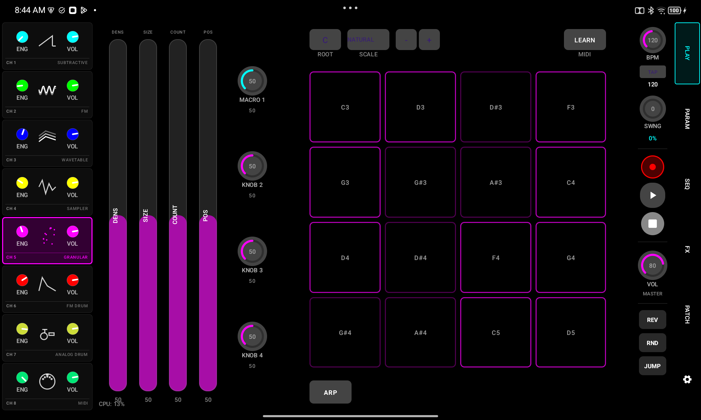
<!-- slide -->
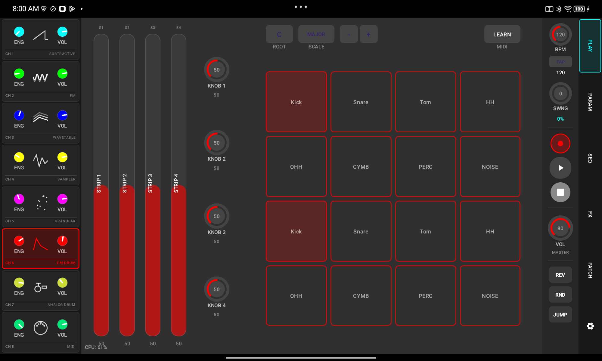
````

- **Arpeggiator Menu**: Long-press the **ARP** button to open the advanced Arpeggiator configuration.
    - **Rhythms**: 4 independent lanes (Root, and the next several steps in the scale) for complex rhythmic patterns, and a Random Rhythm button to generate a new random pattern (of root note only for you to add to).
    - **Patterns**: 10 different arpeggiator patterns, including a random that generates a fresh pattern each time it is selected.
    - **Octaves & Inversion**: Expand the range or flip the chord voicing.
    - **Rate and Division**: Set the speed of the arpeggio relative to the track BPM, with options for dotted and triplet timing.
    - **Chord Progression Generator**: Uses the selected root note, currently played notes, and arpeggiator settings.  Choose a mood and a level of complexity for the pattern (both melodic and rhythmic complexity).  When switched on, it will alter the arpeggiator notes around your playing (or a latched arpeggiator) to create a 32 bar chord progression.
- **MIDI Learn**: Launches a mode highlighting the MIDI controls on the play screen to select one, and then highlighting every knob in the app, while the user navigates to the screen with the knob they want to control.  Tapping the knob will assign it to the Play screen controller.  Tap again to cancel.
- **Active FX**: At the bottom of every Param screen are strips to show any FX pedals that this track is sending audio to.  Each active effect will have a Send knob displayed in this section allowing the effect to be cut quickly and allowing the user to see where their sound is routed.
- **Bend Learn**: Assign the Y axis modulation from the MIDI playing pads to any knob in Loom.  
---

### Sequencing Screen
Create and edit patterns with the 16-pad grid.

````carousel
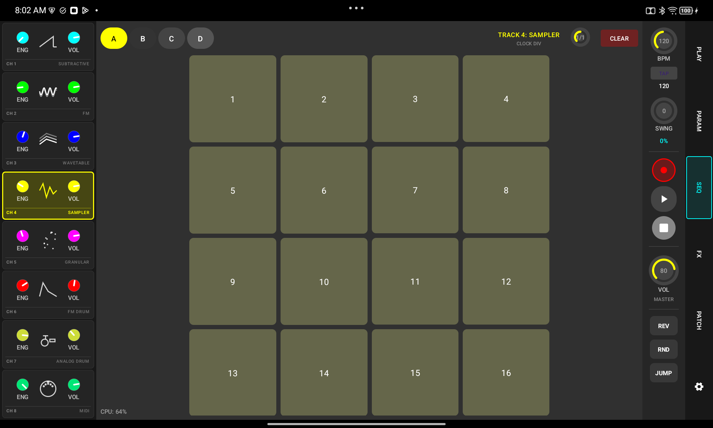
<!-- slide -->
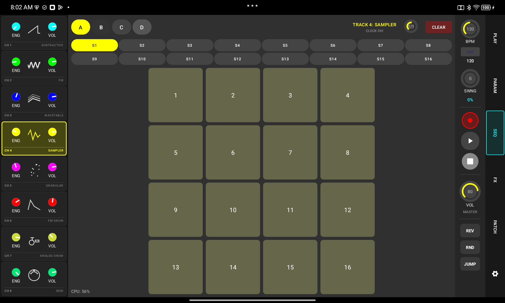
<!-- slide -->
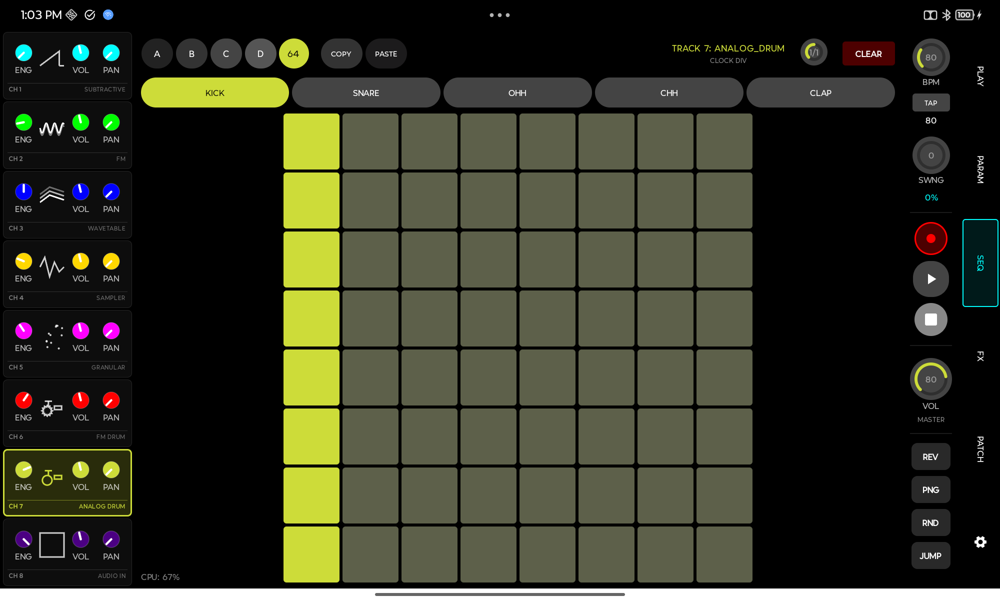
````

- **64-Step Sequencing**: Loom supports sequences up to 64 steps long.
    - **Bank Buttons (A-D)**: Toggle between 16-step pages to edit longer sequences.
    - **64 Grid View**: Tap the **'64'** button to view and edit the entire 8x8 step grid at once, automatically switching the sequence length from 16 to 64 steps.
- **Step Options**: Long-press any active step to access the Step Editor, or to inspect the note and settings in a step.
    - **Visual Reference**: 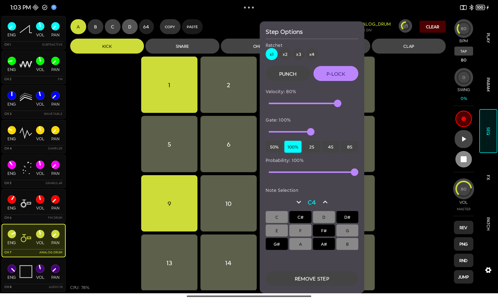
    - **Velocity**: Adjust the loudness of the step.
    - **Gate Length**: Control note duration. Gates > 100% create "Legato" slides. The range extends to **8.0 steps**, with a **cubic response curve** on the slider for surgical precision at short values.
    - **Probability**: Set the chance (0-100%) that the step will play.
    - **P-Lock**: Adjust up to 4 parameters to have different settings for this one step, returning to default when the step is finished.  This option will launch a mode for mapping the parameter to change.
    - **Ratchet**: Repeat the note multiple times within a single step.
    - **Remove Step (Polymetry)**: Tapping **Remove Step** completely excises the step from the sequence for that specific voice. This shortens the loop length, creating **polymetric drift** where voices move out of phase with the main clock.
    - **Microtiming**: Nudge the start point of a step, accurate to .01 steps.
- **Skipped Step Restoration**: Long-press a pad on the sequencer grid to restore a previously "removed" step.
- **Transpose +/-**: Quickly shift the entire sequence pitch by the number of selected steps+octaves.
- **Sequence Chain +/-**: Chain together up to 16 saved sequences in any order and combination to create a longer song.
- **Length in Steps**: Use the Len Step knob to define the length of the sequence pattern in steps.  This is non-destructive and will not delete any steps from the sequence.  Each track can have a different number of steps in the sequence (between 16 and 64 steps).
- **Copy/Paste**: Copy the entire sequence to paste into another track.  If you select a shorter pattern (eg 16 steps) and paste into a longer sequence (eg 64 steps) the pattern will be pasted into the first available steps.
- **Save/Load**: Save your sequence to a local file, or load a saved sequence.
- **Humanize**: Adds variation in the microtiming and velocity for each step in the current sequence.
- **Order**: In the bottom of the Transport bar, you can change the order of the steps played in the sequence.  Plays forward, backward, ping-pong, or random.

---

### Parameters Screen (Sound Design)
Shape your sound using the dedicated controls for each engine.  Every engine supports some common features.  
**Randomize (dice icon)**: Randomize parameters to try your luck with a new sound.  
**Restore Default**: Every engine has a default patch that can be restored, where the user can also set a new default patch to open with new projects.  
**Test Trigger (music note icon)**: Every engine features a test trigger to play the sound with current settings.  
**Save/Load Patch**: Create a preset that can be loaded later, including in new future projects.  
**MIDI Learn**: Launches a mode highlighting the MIDI controls on the play screen to select one, and then highlighting every knob in the app, while the user navigates to the screen with the knob they want to control.  Tapping the knob will assign it to the Play screen controller.  Tap again to cancel.  
**Active FX**: At the bottom of every Param screen are strips to show any FX pedals that this track is sending audio to.  Each active effect will have a Send knob displayed in this section allowing the effect to be cut quickly and allowing the user to see where their sound is routed.

````carousel
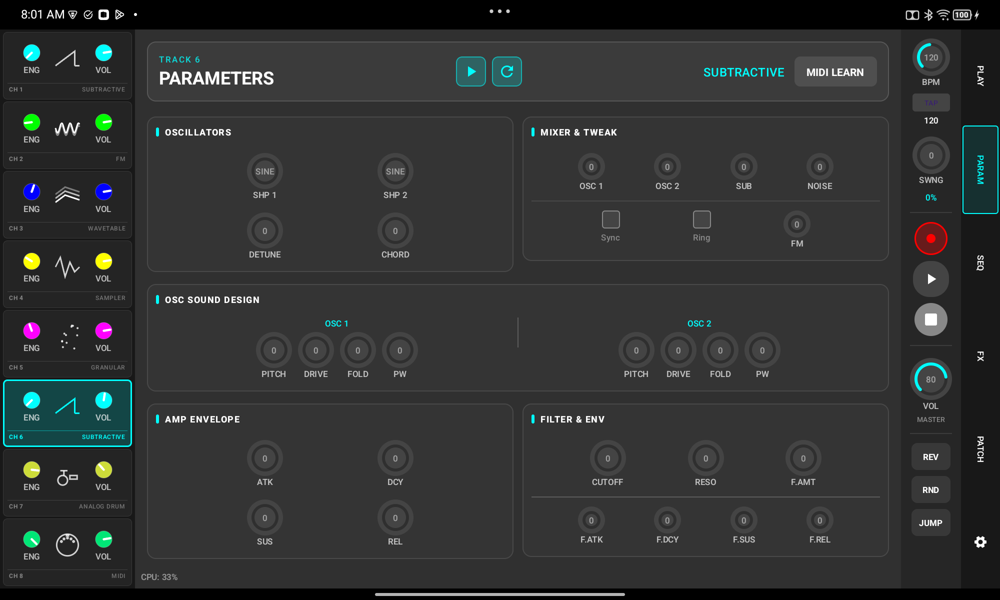
<!-- slide -->
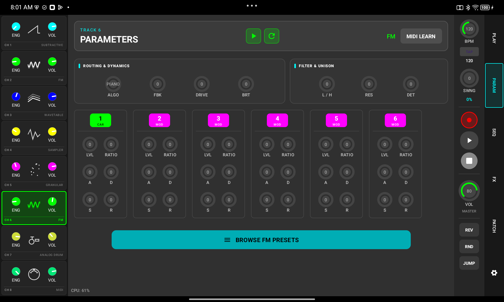
<!-- slide -->
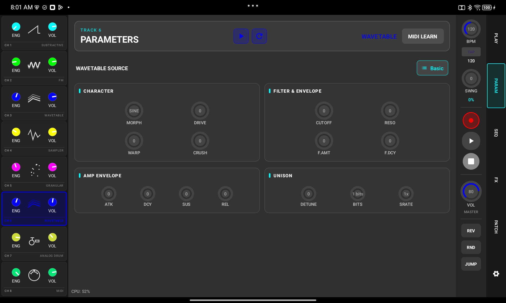
<!-- slide -->
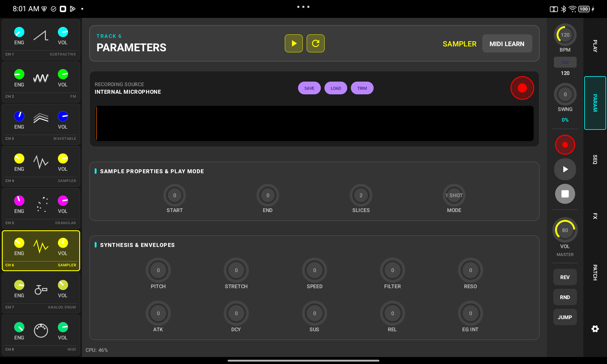
<!-- slide -->
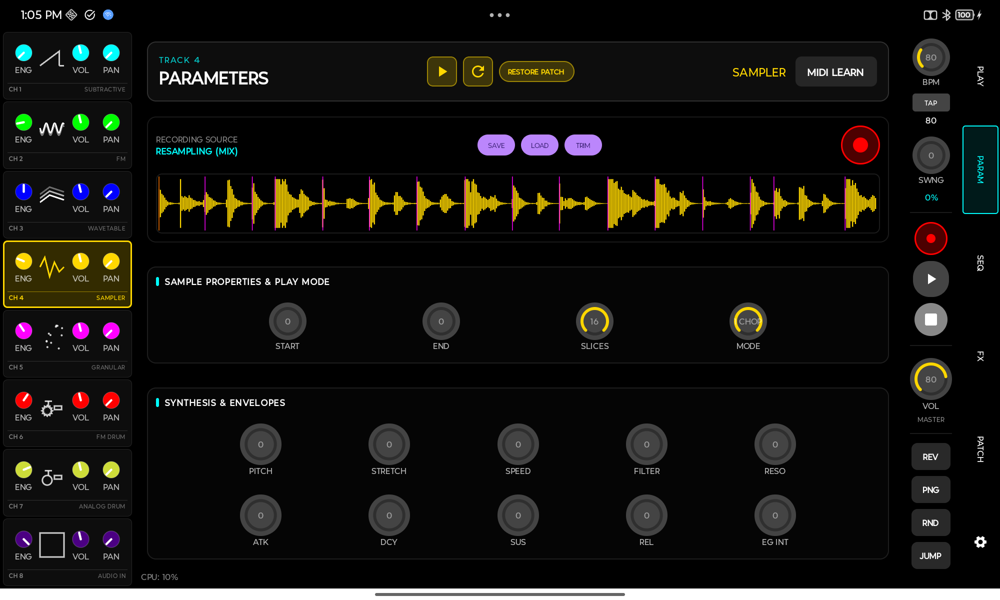
<!-- slide -->
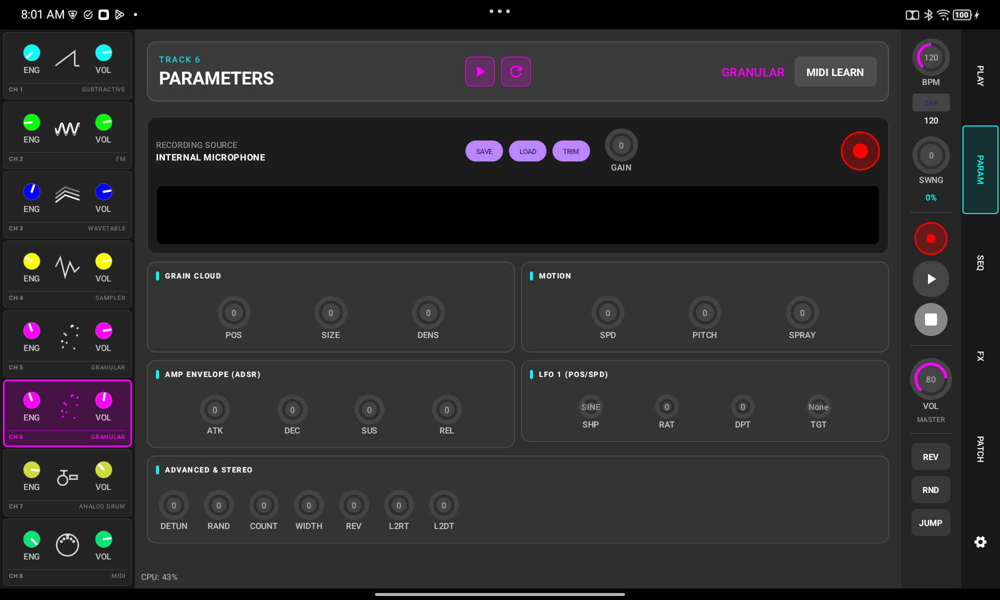
<!-- slide -->
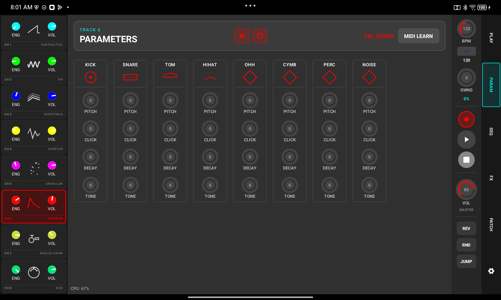
<!-- slide -->
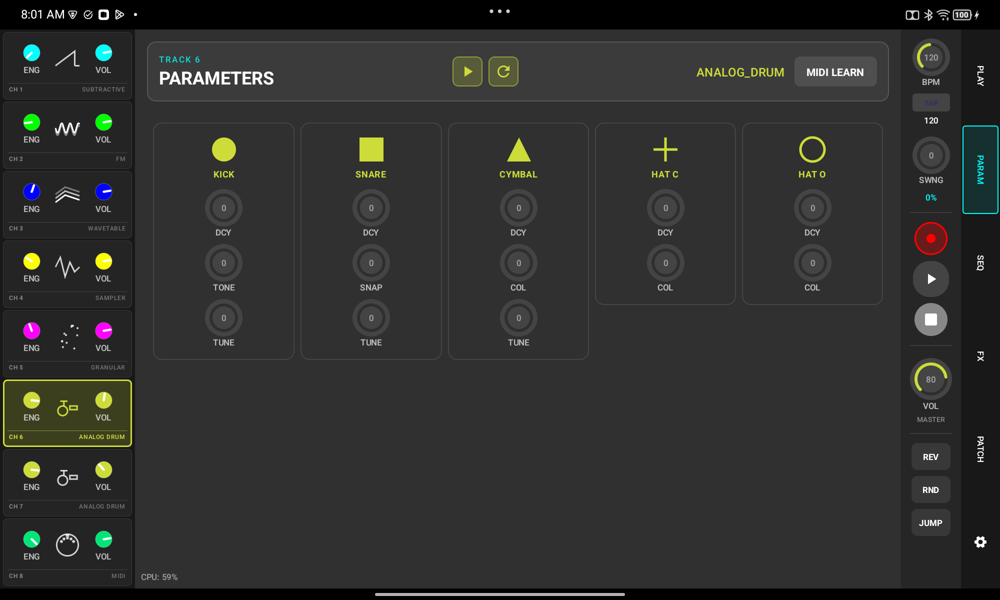
<!-- slide -->
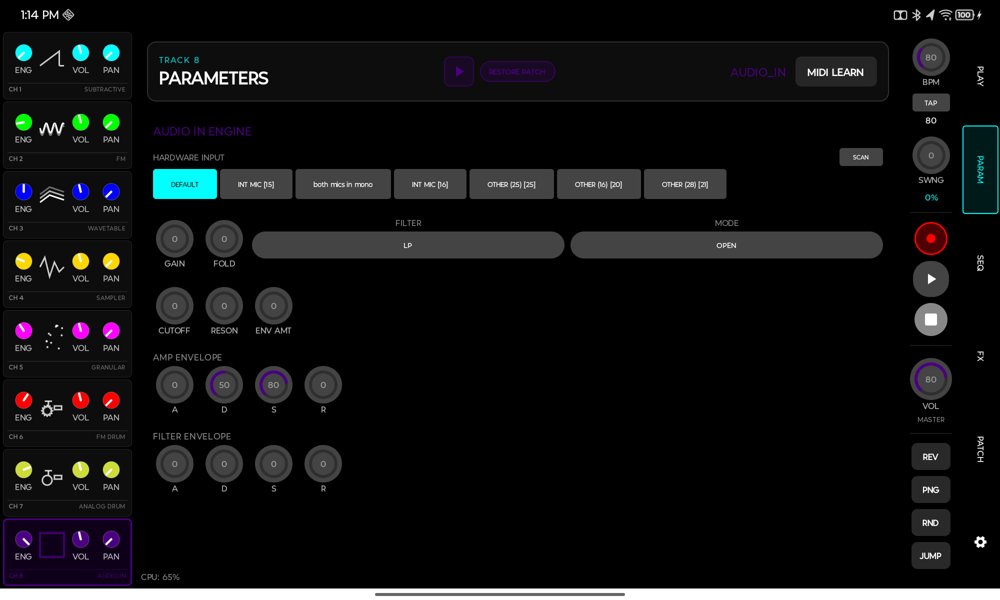
<!-- slide -->
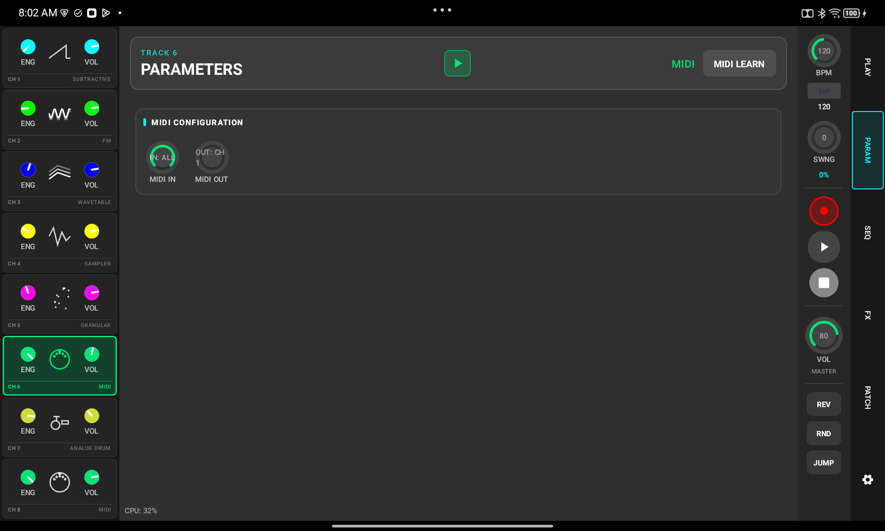
````

#### Subtractive Engine
**Sounds Like**: Classic 70s and 80s analog synths. Great for fat basses, lush pads, and sharp leads.
- **Osc 1-2 Pitch**: Semitone offset for each of the two oscillators.
- **Sub Oscillator**: An additional low-frequency oscillator one octave below for added weight.
- **Osc 1-2-Sub Fold / Drive**: Add harmonic grit via wave-folding or traditional saturation.
- **PW (Pulse Width)**: Modifies the symmetry of square waves for "thin" or "nasal" timbres.
- **Cutoff / Resonance**: Filter the sound to remove high frequencies and add "squelch."
- **Detune**: Offsets oscillator pitches slightly for a thicker, wider sound.

#### FM Engine
**Sounds Like**: 80s digital synths (DX7). Excels at metallic bells, glassy pianos, and complex evolving stabs.
- **Algorithm**: Changes how the 6 operators modulate each other (from serial to parallel).
- **Brightness**: Global modulation depth; the "master harmonic control."
- **Op 1-6 Level / Ratio**: Individual volume and frequency multipliers for the 6 internal operators.
- **Feedback / FB Drive**: Routes signal back into the operator for harsh, noisy textures.

#### Wavetable Engine
**Sounds Like**: Modern digital synthesis. Known for morphing "dubstep" growls and evolving pads.
- **Position**: Sweeps through the frames of the current wavetable file.
- **Warp**: Non-linear phase distortion for unique harmonic shifting.
- **Crush / Bits / Srate**: Digital artifacts and lo-fi reduction for "crunchy" textures.
- **Detune**: Adds subtle pitch variation for a "chorused" feel.
- **Source**: Select one of the included wavetables or load your own.  Supports using audio files from the Sampler and Granular engines.

#### Sampler Engine
**Sounds Like**: Traditional sample playback. Used for acoustic instruments, vocal chops, and found sounds.
- **Pitch**: Changes frequency without changing playback speed (Time-stretching).
- **Stretch**: Changes playback time without changing pitch.
- **Speed**: Classic tape-style control where time and pitch are linked.
- **Reverse**: Plays the loaded sample backwards.
- **Trim Start / End**: Defines the specific region of the sample to be played.
- **Recording Source**: Choose from the microphone, line in, or share the system audio with Loom to record from any app on the device.
- **Suggested BPM**: Say how many times you want the sample to repeat in one loop of the sequencer pattern, and a suggested BPM will be calculated to fit the sample at current settings.  Tap SET to change the project BPM to the suggested value.
- **Sampler Modes**:
  - **One Shot**: Plays once to the end.
  - **Chopped**: Splits audio into up to 16 slices; each slice gets its own independent pad on the play screen and its own track in the sequencer.
  - **One Shot Chops**: Like Chopped, but slices play to the end when triggered.
  - **Loop Chops**: Uses the track's envelope settings to determine the note length, and then loops the slice within that note.  Creates dub-like fading echoes out of samples.
  - **Loop**: Perpetually loops the selected region.
  - **Scrub**: Creates a large pink handle on the sample playhead.  Dragging this handle allows you to manually scrub through the sample with realistic physics to simulate the feel of analogue media.  Fast motions will give a record scratch, slower motion creates dramatic tape stops, and manually dragging the playhead through the sample creates a uniquely warped playback effect.
  **Slice Lock**: When the lock is triggered, each slice of the sample can have its parameters edited independently of the others, allowing you to tailor each slice to create a wide range of sounds for a drum kit, which can be saved as a preset for future tracks.  The select knob (SEL) is used to select which slice to edit.
  **Renaming sequencer tracks**: When samples are slices, each slice will have a separate track in the sequencer Long press on the label for each track on the Seq screen to rename it

#### Granular Engine
**Sounds Like**: Ambient "clouds" and textures. Turns any sample into a wash of microscopic sound particles.
- **Position / Spray**: Where in the sample grains start, and how much random "jitter" is added.
- **Grain Size**: Length of sound particles; smaller is glitchy, larger is smooth.
- **Density**: How many grains are born per second.
- **Detune / Width**: Random pitch variation and stereo positioning for massive textures.
- **Reverse Prob**: The chance that any individual grain will play backwards.

#### Drum Engines (FM & Analog)
**Sounds Like**: High-impact percussion. FM is digital/metallic, Analog is warm/explosive. Use the icons for each drum voice to trigger that sound with the current parameter settings.
- **Pitch (Tune)**: Root frequency of the drum hit.
- **Click (FM)**: Pitch envelope "snap" for kicks or noise burst for snares/hats.
- **Param A (Analog)**: Mode-specific control (*Punch* for Kicks, *Snappy* for Snares, *Spread* for Claps).
- **Param B (Analog)**: Controls *Detune* for metallic hats or *Grit* for other voices.
- **Decay**: Controls the length of the drum tail.

#### Audio In Engine
**Sounds Like**: High-end outboard processing. Run external gear through Loom's signal path.
- **Gain / Wavefold**: Boost and distort the external audio signal.
- **Gate ON/OFF**: When ON, audio only passes when a note is triggered.
- **Filter**: Dedicated Low-pass, High-pass, and Band-pass options with ADSR modulation.

#### Soundfont Engine
**Sounds Like**: A 90s ROMpler keyboard.
- **Various Controls**: Loom does not directly control what parameters are available for each soundfont, but it does allow you to map the 4 knobs on the play screen to any of the available parameters or test the knobs in the Param screen to see which will work.  Custom soundfont files can be imported.  Select a soundfont file with the "SELECT" button, and then choose a preset.  Includes the GeneralUser GS v1.47 soundfont.

#### MIDI Output
**Sounds Like**: Whatever external gear you connect!
- **Channel**: Selects the target MIDI channel (1-16).
- **Gate / Length**: Controls the duration of the external notes sent.

---

### Effects & Signal Flow

Loom includes **18 effect pedals** that can be used in two ways: as a **Parallel Mixer** (default, where each track and each effect go out to the final mix separately), or chained in a **Serial Pedalboard** (configured in the Patch screen).

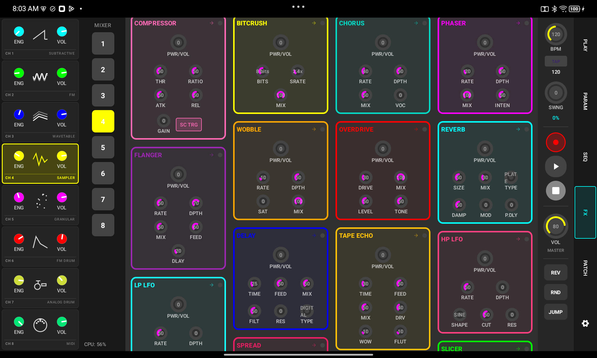

Each pedal has a per-track **SEND** knob (how much signal enters the effect) and a per-track **MIX** knob (dry/wet balance for that track's signal through the effect). This lets you finely control how each track interacts with each effect independently.

#### Serial Chaining Logic
Unlike traditional mixer "sends," the effects in serial mode are connected head-to-tail:
1. **The Chain**: Audio enters Slot 1, then the output of Slot 1 feeds Slot 2, and so on. This means the order matters. For example, placing a **Distortion** before a **Reverb** will result in a distorted sound being washed in reverb. Swapping them will result in the reverb tail being distorted—a much harsher sound.
2. **Pre-Fader / Dry Kill**: The **SEND** amount on each track determines how much signal enters the *start* of the chain (Slot 1). Because this is "Pre-Fader," you can turn a track's main Volume to 0% but keep its SEND at 100% to hear only the processed "Wet" sound.
3. **Pedal Interactions**:
   - **Mix (Dry/Wet)**: Most pedals have a Mix knob. At 0%, the pedal acts as a "bypass," passing the signal from the previous slot through perfectly. At 100%, you only hear the effect's output. 
   - **Cumulative Gain**: Be careful with **Overdrive** or **Bitcrusher** early in the chain, as they can significantly boost the signal level hitting subsequent effects, potentially leading to clipped or "smashed" sounding tails in the Reverb or Delay.
   - **Temporal Feedback**: Effects with internal feedback (Delay, Reverb) keep "playing" even after you stop sending audio to them. This feedback will continue to be processed by any pedals that follow them in the chain.

### Patch Screen - Routing and Macros
- **LFOs**: Loom has a bank of 6 LFOs that can be assigned to any knob in the app (a sound engine parameter, volume or panning in the mixer, a parameter for an effect pedal, etc.)
- **Macros**: Loom has a bank of 8 macros (phone screens need to scroll to see all 8)Connect any modulation source (Left) to up to 3 destinations (Right).  Long-press a modulation target to switch the polarity of the modulation, which is indicated with a red highlight.  Can be connected to the envelope of any currently loaded instrument, an LFO, an assignable knob/slider, or the Y axis modulation of the MIDI play pads.
- **Interactive Nodes**: Tap a node to set the modulation depth. Green nodes represent active connections.  (On phone layout, long press a node to set the modulation polarity)
- **Pedal Chains**: The signal flow goes form left to right, select and remove pedals in any order.  

---

### Settings & Project Management

Project management, interface configuration, and system controls.

````carousel
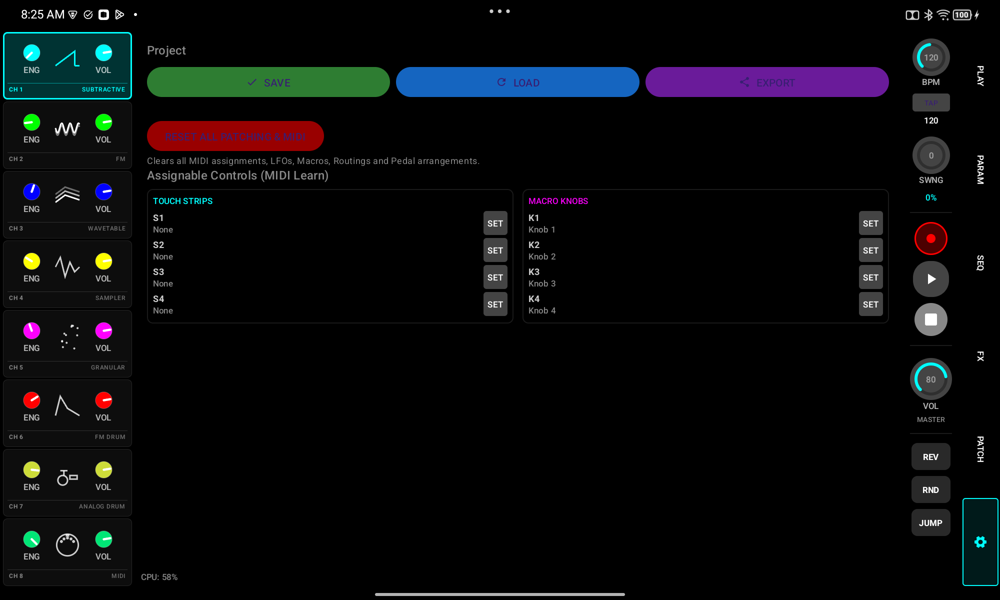
<!-- slide -->
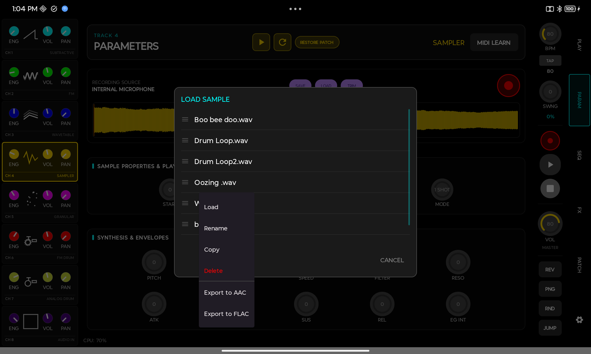
````

#### MIDI Monitor
At the top of the Settings screen, the **MIDI Monitor** panel displays the connected MIDI device name and a live log of incoming MIDI messages — useful for troubleshooting external controllers.

#### UI Layout Mode
Force the interface into **Phone**, **Tablet**, or **Auto** mode. Use this if the automatic detection isn't choosing the layout you prefer for your device.

#### MIDI Pad Gesture Attenuation
Two sliders control the sensitivity of touch gestures on the playing pads:
- **X-Axis (Pitch Bend) Attenuation**: Reduces how much horizontal finger movement bends pitch.
- **Y-Axis (Mod) Attenuation**: Reduces how much vertical finger movement applies modulation.

Set these lower for more controlled, subtle gestures, or higher for dramatic expression.

#### Project Management
- **NEW**: Start a fresh, empty project.
- **SAVE**: Save the current project with a name. You can overwrite existing projects by tapping their name in the save dialog.
- **LOAD**: Browse and load saved projects. Long-press a project for options to **Copy**, **Rename**, or **Delete** it. Loading a project also triggers an engine reset for stability.
- **EXPORT**: Render the current sequence to a **.wav** audio file. You can set the number of sequence loops to render before exporting.

#### Reset Audio Engine (PANIC)
If the audio becomes silent, distorted, or "heavy," tap this button. It performs a **"Nuclear Reset"** by completely reconstructing the native audio engine, clearing out any bad state or NaN (Not-a-Number) values.

#### Reset All Patching & MIDI
Clears **all** MIDI assignments, LFO routings, Macros, Routing connections, and FX chain slots — returning the entire modulation system to a blank slate without affecting your engine settings or sequences.

#### Resources
Links to the [Loom Groovebox YouTube Channel](https://www.youtube.com/@LoomGroovebox) and [GitHub Repository](https://github.com/Co-oscillator/loom-groovebox) are available directly from the Settings screen.

---

## 3. Advanced Features

### Arpeggiator Polyphony
The Arpeggiator supports 4 rhythm lanes:
1. **ROOT (Bottom)**: Triggers the base note of the arpeggio cycle.
2. **UP 1 / UP 2 / UP 3**: Cycle through the remaining held notes, allowing for complex polyphonic interplay even with monophonic engines.

### Gain Staging
To provide maximum headroom and prevent clipping:
- Track volumes are default-scaled to **45%** on load.
- Global saturation and internal gain stages are optimized to allow for layering multiple heavy synth engines without digital distortion.
- **Global Limiter**: A master soft-limiter prevents digital overs at the final output.

### Performance & UI Updates
- **High-Precision Export**: The export system provides real-time progress feedback and notifications when files are ready.
- **Contextual Interface**: Buttons like **ARP** automatically hide for engines that don't support them (like FM Drum or Sampler Chops), keeping the workspace clean.
- **CPU Smart-Decimation**: The engine now optimizes filter and envelope calculations dynamically to ensure stable performance even on older devices.

---

## 4. SoundFont Libraries

Loom includes a curated **Starter Pack** of high-quality, open-licensed SoundFonts to get you started immediately.

### Included in the App
- **GeneralUser GS** by S. Christian Collins ([GNU GPL v2](http://www.schristiancollins.com/generaluser.php))
- **MuseScore MS Basic** by MuseScore Team ([MIT / GPL](https://musescore.org/en/handbook/3/soundfonts-and-sfz-files#list))
- **FreePats Project** by the FreePats Community ([GPL / CC-BY-SA](https://freepats.zenvoid.org/))

### Recommended External Collections
The following libraries are highly recommended for professional use but are not bundled due to their large size (2GB+):
- **VSCO 2: Community Edition** (CC0 Public Domain) - Orchestral strings, brass, and woodwinds.
- **SGM-V2.01** (CC-BY Attribution) - Realistic guitars and pianos. Credit to the author (Shan).

You can import these manually via the **SELECT SF2** button in the SoundFont engine parameters.
